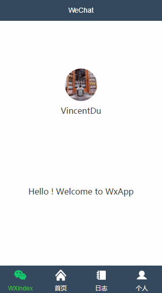
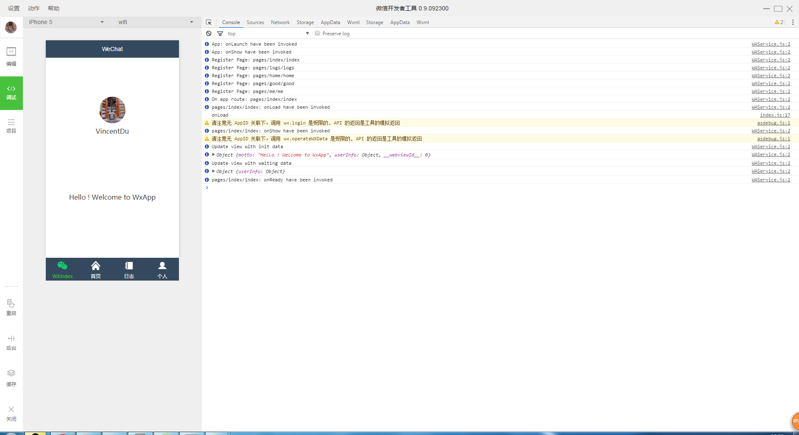
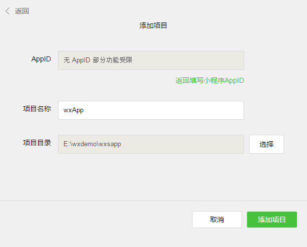
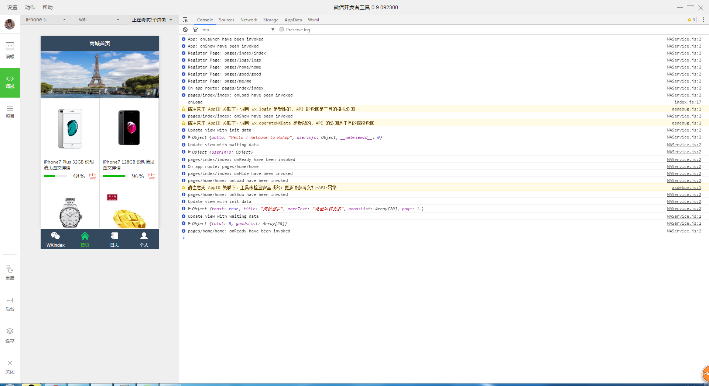

# 微信小程序 Demo（上手练手例子）

> 自从微信小程序内测以来，就各大技术论坛或者技术新闻都相继报道

> 所以我也不落伍吧！ 就自己也开始开搞的微信小程序，探究到底何来那么大的魅力

> 官方文档：https://mp.weixin.qq.com/debug/wxadoc/dev/

### 小程序截图预览



### 项目结构
<pre>
│  .gitattributes
│  .gitignore
│  app.js                # 小程序逻辑
│  app.json              # 小程序公共设置（页面路径、窗口表现、设置网络超时时间、设置多tab）
│  app.wxss              # 小程序公共样式表
│  README.md             # 小程序项目说明
│  tree.txt
│  
├─common                 # 小程序公用模块
├─image                  # 小程序图片资源
|
├─pages                  # 小程序文件
│  ├─good     
│  ├─home
│  ├─index        
│  │    index.js    # 页面逻辑
│  │    index.wxml  # 页面渲染层
│  │    index.wxss  # 页面样式
│  ├─logs
│  └─me
│          
└─utils                  # 小程序公用方法模块        
    util.js    
</pre>


### 开发环境
下载地址 ：https://mp.weixin.qq.com/debug/wxadoc/dev/devtools/download.html?t=1474887501214



### 使用说明

1. 将仓库克隆到本地：

  ```bash
  $ git clone https://github.com/zce/weapp-demo.git
  ```

2. 打开`微信Web开放者工具`（注意：必须是`0.9.092300`版本）

3. 选择`添加项目`，填写或选择相应信息

  - AppID：点击右下角`无AppID`
  - 项目名称：随便填写，因为不涉及到部署，所以无所谓
  - 项目目录：选择刚刚克隆的文件夹
  - 点击`添加项目`


  

4. 项目启动成功




### 个人感受
> 小程序的文档还很多没完善，但腾讯的产品很快就能完善的，当然我感觉应该带动一股热潮

>所以觉得有必要去上手练习一下，如果之前用ng或者vue这类的mvvm框架，应该很快上手小程序

>文档有有一段话介绍

  框架

  小程序开发框架的目标是通过尽可能简单、高效的方式让开发者可以在微信中开发具有原生 APP 体验的服务。

  框架提供了自己的视图层描述语言 WXML 和 WXSS，以及基于 JavaScript 的逻辑层框架，并在视图层与逻辑层间提供了数据传输和事件系统，可以让开发者可以方便的聚焦于数据与逻辑上。


> 伟大的前端之路 对于我来说还远着 共勉
